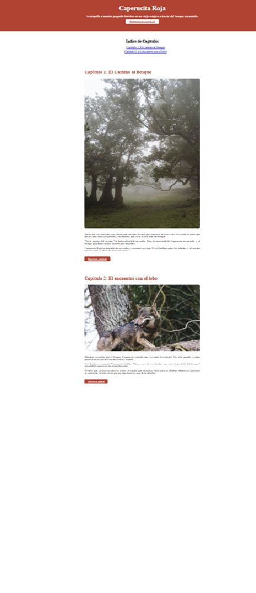

# Caperucita Roja

Ejercicio sobre el cuento de Caperucita para trabajar con Git y GitHub.

He creado una página web que cuenta la historia de Caperucita Roja usando HTML y CSS.

## Prototipo

Antes de programar, he diseñado las pantallas en Stitch. La historia tiene estas partes:

- Portada con el título y un botón para empezar
- Capítulo 1: El Camino al Bosque
- Capítulo 2: El encuentro con el lobo

Todo va en una sola página con scroll.

## Plan de commits

Voy a ir haciendo commits poco a poco, siguiendo este orden:

1. Primero el README con la planificación
2. Estructura HTML básica (header y footer)
3. Índice de capítulos
4. Capítulo 1
5. Capítulo 2
6. Estilos CSS generales
7. Estilos de los capítulos
8. Añadir imágenes
9. Diseño responsive
10. Captura final en el README

## Tecnologías

- HTML5
- CSS3
- GitHub Pages

## Enlace

https://gmp395.github.io/ex-git-little-red-riding-hood

## Captura del resultado

